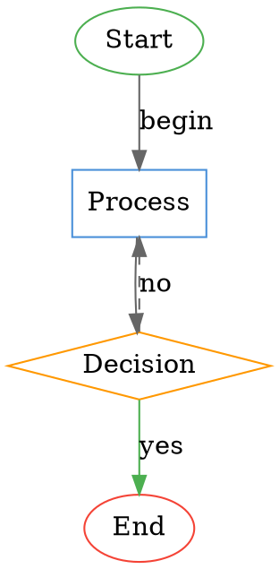

# dot2d3

A Go library and CLI tool that converts Graphviz DOT files into interactive D3.js visualizations.

## Features

- **Parse DOT files** - Full support for graphs, digraphs, subgraphs, and attributes
- **Interactive D3.js output** - Force-directed graph layout with:
  - Draggable nodes
  - Zoomable/pannable canvas
  - Clickable nodes (emits JavaScript events)
  - Hover tooltips
  - Degree-of-separation filter slider
- **Multiple output formats** - HTML (self-contained) or JSON
- **Server mode** - HTTP API for on-demand conversion
- **Docker support** - Ready-to-deploy container image

## Installation

### Go Install

```bash
go install github.com/anthonybishopric/dot2d3/cmd/dot2d3@latest
```

### Build from Source

```bash
git clone https://github.com/anthonybishopric/dot2d3.git
cd gographviz
go build -o dot2d3 ./cmd/dot2d3
```

### Docker

```bash
docker build -t dot2d3 .
```

## Usage

### CLI Mode

```bash
# Convert DOT file to HTML
dot2d3 graph.dot > output.html

# Specify output file
dot2d3 -o output.html graph.dot

# Custom title
dot2d3 -t "My Network Graph" -o output.html graph.dot

# Output JSON instead of HTML
dot2d3 --json graph.dot > graph.json

# Read from stdin
echo 'digraph { A -> B -> C }' | dot2d3 > quick.html

# Pipe from another command
cat graph.dot | dot2d3 -o output.html
```

### Server Mode

Start the HTTP server:

```bash
dot2d3 -serve :8080
```

Or with Docker:

```bash
docker run -d -p 8080:8080 dot2d3
```

#### API Endpoints

**POST /convert**

Convert DOT content to D3 visualization.

```bash
# Get HTML output
curl -X POST -d 'digraph { A -> B -> C }' http://localhost:8080/convert > graph.html

# Get JSON output
curl -X POST -d 'digraph { A -> B }' "http://localhost:8080/convert?format=json"

# Custom title
curl -X POST -d @graph.dot "http://localhost:8080/convert?title=My%20Graph" > output.html
```

**GET /**

Web UI with a form to paste and convert DOT content directly in the browser.

### As a Go Library

```go
package main

import (
    "fmt"
    "github.com/anthonybishopric/dot2d3/pkg/dot"
)

func main() {
    src := []byte(`digraph G {
        A -> B -> C
        B -> D [color=red]
    }`)

    // Parse DOT
    graph, err := dot.Parse("example", src)
    if err != nil {
        panic(err)
    }

    // Generate HTML
    html, err := dot.ToHTML(graph, dot.RenderOptions{
        Title: "My Graph",
    })
    if err != nil {
        panic(err)
    }
    fmt.Println(string(html))

    // Or generate JSON
    json, _ := dot.ToJSON(graph)
    fmt.Println(string(json))
}
```

## DOT Language Support

### Supported Features

- `graph` (undirected) and `digraph` (directed)
- `strict` modifier (prevents duplicate edges)
- Node statements with attributes
- Edge statements with `->` and `--` operators
- Edge chains: `A -> B -> C -> D`
- Edge shorthand: `A -> {B C D}` (creates A→B, A→C, A→D)
- Subgraphs: `subgraph cluster_name { ... }`
- Default attributes: `node [shape=box]`, `edge [color=red]`
- Comments: `//`, `/* */`, and `#` preprocessor lines
- Quoted strings: `"hello world"`
- HTML labels: `<<b>bold</b>>`
- Port syntax: `A:port1 -> B:port2:n`

### Supported Attributes

| Attribute | Applies To | Description |
|-----------|------------|-------------|
| `label` | node, edge | Display text |
| `color` | node, edge | Fill/stroke color |
| `fillcolor` | node | Fill color (alias for color) |
| `shape` | node | `ellipse`, `box`, `diamond` |
| `style` | edge | `dashed` for dashed lines |

Other attributes are preserved in the JSON output and available via tooltips.

### Example DOT File



## Interactive Features

The generated HTML visualization includes:

### Node Interaction
- **Click** a node to select it (orange highlight)
- **Click again** or click background to deselect
- **Drag** nodes to reposition them
- **Hover** to see tooltip with node attributes

### Graph Navigation
- **Scroll wheel** to zoom in/out
- **Click and drag** background to pan
- **Double-click** to reset zoom

### Degree Filter
- Select a node, then use the **degree slider** (1-5) to filter the view
- Shows only nodes within N connections of the selected node
- Set to "All" to show the complete graph

### JavaScript Events

The visualization emits custom events you can listen for:

```javascript
// Fired when a node is clicked
document.addEventListener("nodeClick", function(e) {
    console.log("Node clicked:", e.detail);
    // e.detail = { id, label, color, shape, group, attributes, position, selected }
});

// Fired when the filter changes
document.addEventListener("filterChange", function(e) {
    console.log("Filter changed:", e.detail);
    // e.detail = { selectedNodeId, degree, visibleNodeCount }
});
```

## Project Structure

```
gographviz/
├── cmd/dot2d3/          # CLI application
│   └── main.go
├── pkg/
│   ├── token/           # Lexical tokens
│   ├── lexer/           # DOT tokenizer
│   ├── ast/             # Abstract syntax tree
│   ├── parser/          # Recursive descent parser
│   ├── d3/              # D3 graph structures & HTML renderer
│   └── dot/             # High-level API
├── examples/            # Example DOT files
├── Dockerfile
└── README.md
```

## Docker

### Build

```bash
docker build -t dot2d3 .
```

### Run

```bash
# Start server on port 8080
docker run -d -p 8080:8080 --name dot2d3 dot2d3

# Custom port
docker run -d -p 3000:8080 dot2d3

# View logs
docker logs dot2d3
```

### Docker Compose

```yaml
services:
  dot2d3:
    build: .
    ports:
      - "8080:8080"
    restart: unless-stopped
```

## Development

### Run Tests

```bash
go test ./...
```

### Run with Verbose Output

```bash
go test -v ./...
```

### Build and Test Locally

```bash
go build ./cmd/dot2d3
echo 'digraph { A -> B -> C }' | ./dot2d3 > test.html
open test.html
```

## License

MIT
